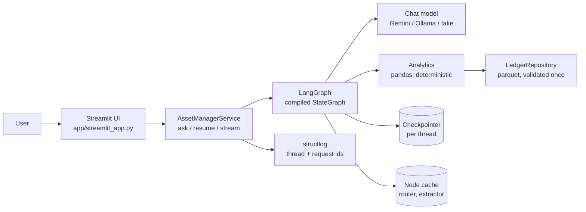

# Architecture

## 1. The one principle

**LLM at the edges, code in the middle.** The language model does two jobs it is good at: understanding the question (classify, extract) and phrasing the answer. Everything between those two edges — resolving names, anchoring dates, filtering, arithmetic, anomaly detection — is deterministic Python with unit tests and golden numbers. The model never does math, and every figure in a model-written answer is checked against the computed result before it is shown.

Why. A finance assistant that is sometimes off by a rounding or a hallucinated total is worse than useless; an asset manager will stop trusting it after the first miss. Putting the numbers in code makes them reproducible and testable; putting the language in the model keeps the product flexible.

## 2. System view



Packages, one responsibility each.

| Package | Responsibility | LLM? |
|---|---|---|
| `domain/` | value objects: `Period`, `LedgerFilter`, enums, money formatting, errors | no |
| `data/` | schema contract, repository protocol (parquet + in-memory), duplicate policy | no |
| `resolve/` | mentions → canonical names (rapidfuzz), period specs → concrete periods, metric availability | no |
| `analytics/` | P&L, comparisons, tenant ranking, asset profile, eight anomaly detectors | no |
| `llm/` | provider factory, structured-output retry, prompts, keyword fallback rules, scripted fake | yes |
| `graph/` | state, nodes, edges, builder, templated rendering | orchestrates |
| `service.py` | public façade, threads, logging | — |
| `app/` | Streamlit UI and its pure helpers | — |

## 3. Graph

Generated diagram: [diagrams/graph.md](diagrams/graph.md).

```
START → guard ─┬─(invalid)→ clarifier ─[interrupt]─→ guard
               └→ router ─┬─ clarify → clarifier
                          ├─ unsupported → END
                          ├─ general_knowledge → general → END
                          ├─ compound → Send(sub_question) x N → synthesizer → END
                          └→ extractor → resolver ─┬─ unresolved → clarifier
                                                   └→ analyst_* → synthesizer → END
```

Agents and what each one owns.

1. **guard** — deterministic input validation: empty, unreadable, over 2,000 characters, code or SQL. Rejections become a clarification, not an error.
2. **router** — one structured LLM call → `RouteDecision{intent, confidence, sub_questions, clarification}`. Guard-rails in code: low confidence becomes `clarify`; a compound question missed by the model is caught by a keyword splitter; fan-out is capped at four sub-questions.
3. **extractor** — one structured LLM call → `ExtractedEntities`. Then a merge: fields the model left empty are filled from keyword rules, and any period the model returned only as text (`raw: "Q2 2024"`) is parsed by code. "The model finds spans, code parses them."
4. **resolver** — no LLM. Fuzzy-matches properties and tenants (a number in the mention is decisive), anchors relative periods to the data's as-of month, applies per-intent defaults (no period → all data; comparison with one period → same period last year), maps ledger vocabulary, substitutes unsupported metrics (price → P&L, disclosed). Anything it cannot resolve becomes `Unresolved{reason, suggestions}`.
5. **analysts** (six) — thin adapters over `analytics/`. Each returns a typed result carrying its provenance: filter, period, policy, as-of, row count.
6. **synthesizer** — one plain LLM call over the results as JSON. The reply is grounded: every number in it must exist in the results (years and small counts excluded), otherwise the templated answer is used. The model's own "Steps" line is discarded and replaced with the real trace.
7. **clarifier** — `interrupt()` with the question; the reply is merged into the original question and the graph re-enters at the guard. Two rounds, then it gives up with examples.
8. **sub_question** — runs a compiled subgraph (router → extractor → resolver → analyst) per sub-question; the parent fans out with `Send` and the `results`/`trace`/`errors` reducers merge the branches.
9. **general** / **unsupported** — model knowledge with an enforced prefix and no data access; scope explanation.

## 4. Data flow for one question

`"How does this quarter compare to the same period last year?"`

1. guard: ok.
2. router (LLM, ~2 s on Gemini Flash-Lite): `period_compare`, 0.95.
3. extractor (LLM): periods `[this_quarter, same_period_last_year]`, metric `pnl`.
4. resolver: as-of is 2025-M03 → `2025-Q1`; base for "same period last year" is the first period → `2024-Q1`. Note recorded: anchored to the data as of 2025-03.
5. analyst_compare_periods: `compute_pnl` twice, delta 99,501.25, +37.93 %, like-for-like (3 months vs 3 months).
6. synthesizer (LLM): prose; grounding check passes; Steps appended from the trace.

Three model calls, all three replaceable by rules and templates if the provider is down (`degraded=true` in the result and a notice in the UI).

## 5. State and reducers

`AgentState` is a `TypedDict`. Scalars (`question`, `route`, `resolved`) are overwritten; `results`, `trace`, `errors` use `operator.add` and `degraded` uses `operator.or_`, so parallel `Send` branches append instead of colliding. Every result model carries a `kind` literal, and `AnalysisResult` is a discriminated union, so the synthesizer and the UI never guess types.

## 6. Reliability

1. **Structured output with feedback.** `invoke_structured` asks for a pydantic object; a validation failure is fed back to the model once or twice; transport errors and exhausted retries raise one exception type (`LLMUnavailableError`) that nodes catch.
2. **Degradation chain.** LLM → keyword rules (router, extractor) and LLM → template (synthesizer, general). Tests run the entire graph with the fake provider and an empty script, which exercises exactly this path; the browser smoke does the same against a real server.
3. **Grounding.** Numbers in the answer are checked against the result set with a 0.005 tolerance; sign is ignored (dropping a minus is not invention), years and small integers are skipped.
4. **Bounded loops.** Two clarification rounds; four sub-questions; `recursion_limit` from settings; generation capped (`num_predict`) on Ollama.
5. **Caching.** `CachePolicy` on router and extractor keyed on `(question, policy)`, one hour TTL. A repeated question costs one model call (the synthesizer) instead of three; on the free tier that matters.
6. **Fail fast on data.** The parquet is validated against a column contract at load; drift raises before any answer is produced.

## 7. Security

1. User text enters prompts inside `<user_question>` delimiters and every system prompt states that the content is data, not instructions. Routing is a closed enum; the resolver only accepts names that exist in the dataset; the synthesizer cannot introduce numbers. An injection attempt can at most produce an `unsupported` answer.
2. No secrets in code or settings objects: the Google SDK reads its key from the environment; settings `repr` never contains it; `.env` and `secrets.toml` are gitignored; a pre-commit hook blocks obvious key patterns.
3. No dynamic code execution, no SQL, no shell. Data access is pandas over a local file behind a repository interface.
4. Logs carry ids, intents, node names and timings — never the question or the answer.
5. External traffic (Gemini) is HTTPS via the SDK; Ollama and the UI are loopback in development.

## 8. Efficiency

1. One question = 3 model calls (router, extractor, synthesizer); general knowledge = 2; compound = 1 + 2 per sub-question + 1. Cached repeats = 1.
2. Small model for classification and extraction, larger for prose (`gemini-3.5-flash-lite` / `gemini-3.5-flash`).
3. Data loaded once per process; analytics are vectorised pandas over 3,924 rows (sub-millisecond per query).
4. Measured locally with Ollama `qwen3.5:9b`, thinking disabled: 5–8 s per question end to end (18–93 s with thinking enabled, which is why it is disabled).

## 9. Scaling up and out

What would change, in order, if this served a team instead of one reviewer.

1. **Checkpointer** — `MemorySaver` → Postgres (`langgraph-checkpoint-postgres`) with a retention job. Threads then survive restarts and multiple app replicas share them. Cache → Redis-backed or a TTL-bounded store.
2. **Stateless app tier** — the Streamlit process holds nothing that is not in the checkpointer; run N replicas behind a load balancer with sticky sessions (or move the chat to a FastAPI service and keep Streamlit as a thin client — `AssetManagerService` is already the seam).
3. **Data** — `LedgerRepository` is a protocol; a DuckDB or warehouse implementation replaces the parquet reader without touching analytics. Multi-entity means adding `entity_name` to `LedgerFilter` and to the resolver's vocabulary.
4. **Throughput** — `ainvoke`/`astream` for concurrent users; `Send` branches already run in parallel; per-tenant rate limiting in front of the provider; a queue for batch questions.
5. **Model tiering and evals** — keep the small/large split; add the live eval suite (`tests/eval`) to a nightly job against the real provider so prompt or model changes are caught by golden questions, not by users.
6. **Observability** — LangSmith tracing is one environment variable away; structlog already emits JSON with request ids, so shipping to a log stack is a sink, not a rewrite.

## 10. Non-goals

Authentication and multi-tenancy, valuations or market data, write operations on the ledger, and a general BI tool. Each is a documented extension point, not a half-built feature.
