# Graph topology

Generated with `AssetManagerService.mermaid()` (LangGraph `get_graph().draw_mermaid()`). Regenerate after any change to `src/propco_agent/graph/builder.py`:

```bash
PROPCO_LLM_PROVIDER=fake uv run python -c "from propco_agent.config import *; from propco_agent.service import AssetManagerService; print(AssetManagerService.from_settings(Settings(_env_file=None, llm_provider=LLMProvider.FAKE)).mermaid())"
```




Static SVG render above (`img/graph-topology.svg`) for viewers without mermaid support; regenerate it after any change to the mermaid block (e.g. `npx -y @mermaid-js/mermaid-cli -i graph.mmd -o img/graph-topology.svg -b white`).

Notes:

1. `sub_question` runs a compiled subgraph (router → extractor → resolver → analyst, or `sub_fail`) once per sub-question; the parent fans out with `Send` and the `results`/`trace`/`errors` reducers merge the branches before `synthesizer`.
2. `clarifier` pauses the run with `interrupt()`; the reply re-enters at `guard` with the enriched question. Bounded to two rounds.
3. `router` and `extractor` carry a `CachePolicy` keyed on `(question, policy)` with a one-hour TTL.

## Node job definitions

One line per node: what it does and nothing more. `LLM` = makes a model call; everything else is deterministic Python, unit-tested independently of the graph.

| Node | LLM? | Job |
|---|---|---|
| `guard` | no | Rejects input that isn't a natural-language question (empty, unreadable, too long, code/SQL/JSON-shaped) before any model call is spent on it. |
| `router` | yes, rules fallback | Classifies intent and detects compound (multi-part) requests. Falls back to keyword rules if the model is unreachable; forces `clarify` below a confidence threshold; caps fan-out at 4 sub-questions. |
| `extractor` | yes, rules fill gaps | Finds the properties, tenants, periods, metric and filters mentioned in the question. "Model finds spans, code parses them" — any field the model leaves implicit is filled by rules, and raw period text is re-parsed deterministically. |
| `resolver` | no | Turns extracted mentions into a validated, executable query: fuzzy-matches names with suggestions, resolves relative periods against `as_of`, substitutes unsupported metrics with a disclosure. Anything it can't resolve becomes `Unresolved` → a clarification. |
| `analyst_pnl` / `analyst_compare_periods` / `analyst_compare_properties` / `analyst_tenants` / `analyst_asset_details` / `analyst_anomalies` | no | One per intent; each is a thin adapter calling one pure `analytics/*.py` function (`compute_pnl`, `compare_periods`, …) over the resolved query. All the arithmetic and data-quality logic lives in that function, not the node. |
| `sub_question` | no (invokes a subgraph that does) | Runs the compiled router→extractor→resolver→analyst subgraph once per sub-question of a compound request; returns only the reducer keys (`results`, `trace`, `errors`, `notes`) so parallel `Send` branches never collide on the parent's scalar state. |
| `clarifier` | no | Pauses the run with `interrupt()`, holding a question and suggestions for the user. On resume, folds the reply into the original question and re-enters at `guard`. Bounded by `MAX_CLARIFY_ROUNDS`. |
| `general` | yes | Answers real-estate finance concept questions (NOI, cap rate, …) from the model's own knowledge — explicitly prefixed as general knowledge, no ledger access. |
| `unsupported` | no | Explains the assistant's scope for out-of-scope or adversarial input (e.g. a prompt-injection attempt) without touching the model. |
| `synthesizer` | yes, templated fallback | Turns computed results into prose. Every number in the model's text is checked against the computed results (the grounding check); any mismatch, or an unreachable model, falls back to a templated answer with the same numbers. |
