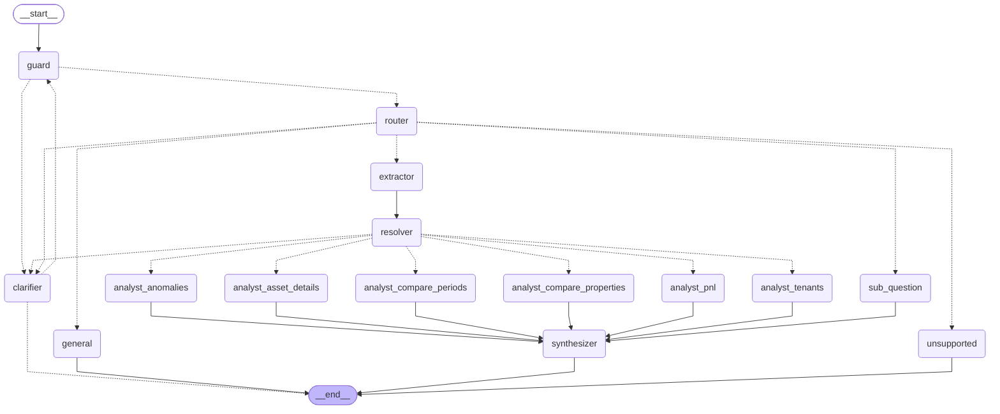

# Graph topology

Generated with `AssetManagerService.mermaid()` (LangGraph `get_graph().draw_mermaid()`). Regenerate after any change to `src/propco_agent/graph/builder.py`:

```bash
PROPCO_LLM_PROVIDER=fake uv run python -c "from propco_agent.config import *; from propco_agent.service import AssetManagerService; print(AssetManagerService.from_settings(Settings(_env_file=None, llm_provider=LLMProvider.FAKE)).mermaid())"
```



Notes:

1. `sub_question` runs a compiled subgraph (router → extractor → resolver → analyst, or `sub_fail`) once per sub-question; the parent fans out with `Send` and the `results`/`trace`/`errors` reducers merge the branches before `synthesizer`.
2. `clarifier` pauses the run with `interrupt()`; the reply re-enters at `guard` with the enriched question. Bounded to two rounds.
3. `router` and `extractor` carry a `CachePolicy` keyed on `(question, policy)` with a one-hour TTL.
