# Use-case sequences

Each diagram is one question through the graph. Node names match `src/propco_agent/graph/`. Model calls are marked `LLM`; everything else is deterministic code.

Each mermaid block is followed by a static SVG render of the same diagram (`img/`), in case your viewer doesn't render mermaid — GitHub, VS Code with the mermaid preview extension, and mermaid.live all do; a plain file browser or an outdated preview extension may not.

## 1. P&L for a period

`What is the total P&L for all my properties this year?`

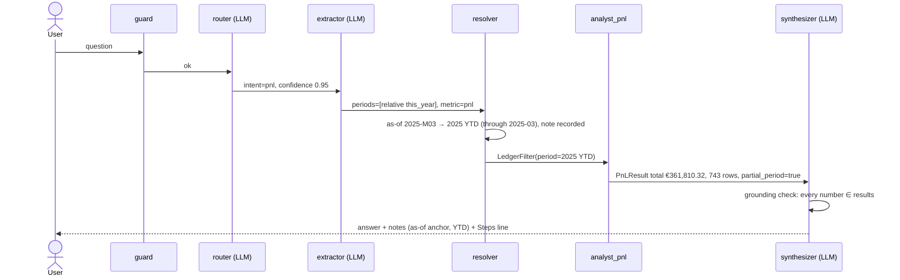

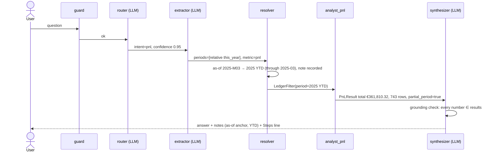

## 2. Period comparison, like-for-like

`How does this quarter compare to the same period last year?`

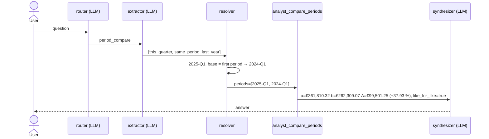

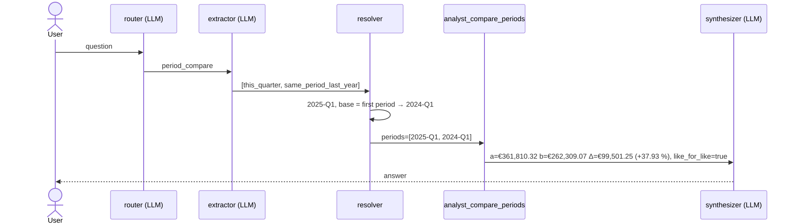

## 3. Clarification with `interrupt`, then resume

`details for 123 Main St`

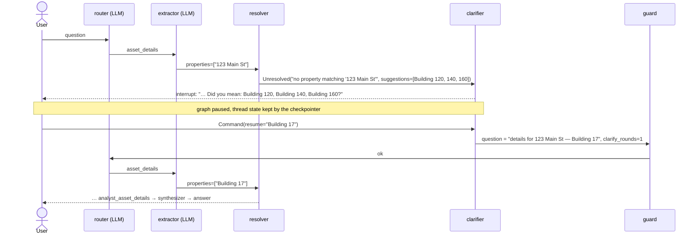

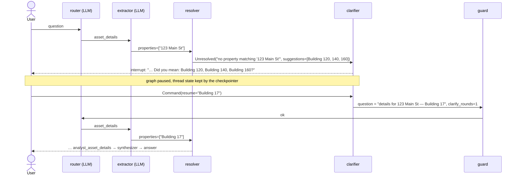

## 4. Compound question, `Send` fan-out

`Who are my top tenants, and is anything unusual in the numbers?`

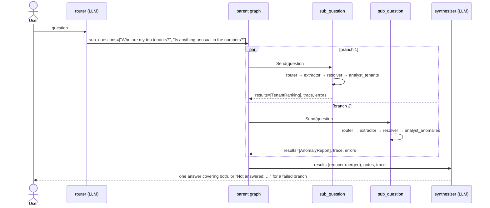

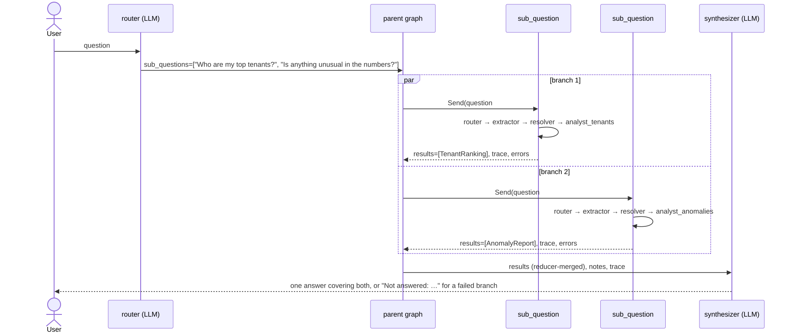

## 5. Unsupported metric, substituted and disclosed

`What is the price of my asset at Building 17 compared to Building 120?`

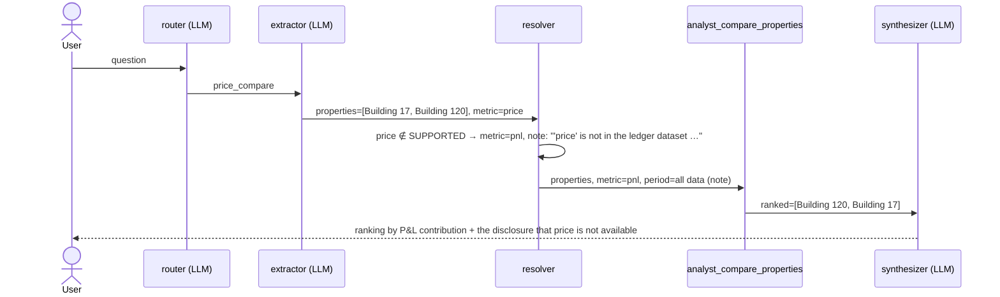

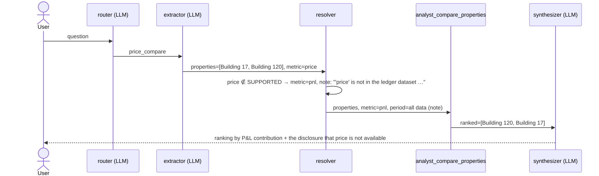

## 6. Provider outage, graceful degradation

Any question while the model is unreachable or out of quota.

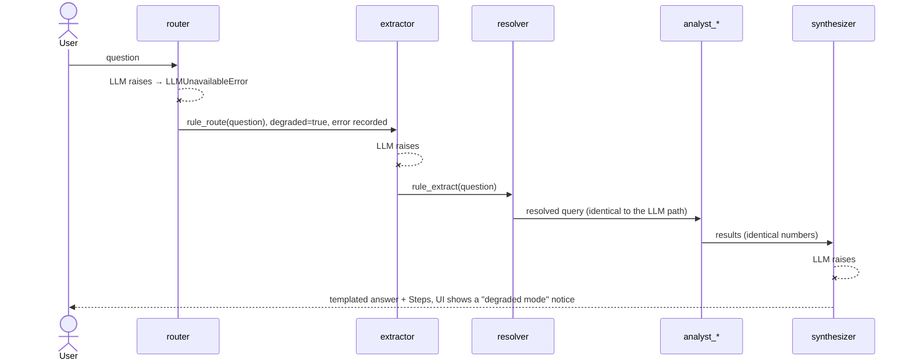

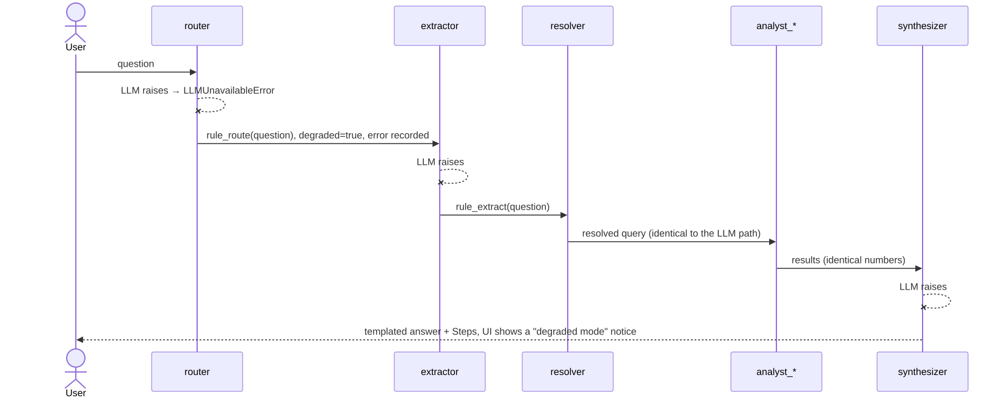

## 7. Anomaly check

`is anything unusual in the numbers?`

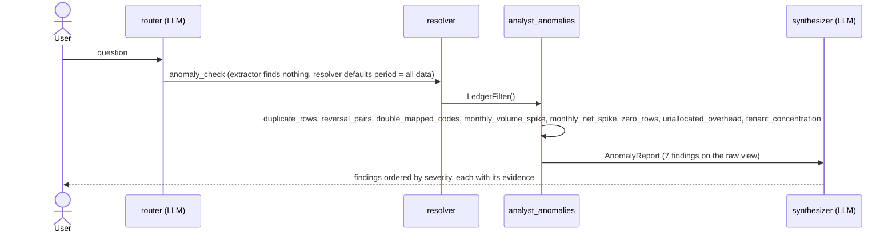

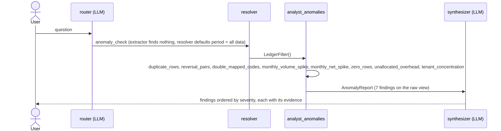
